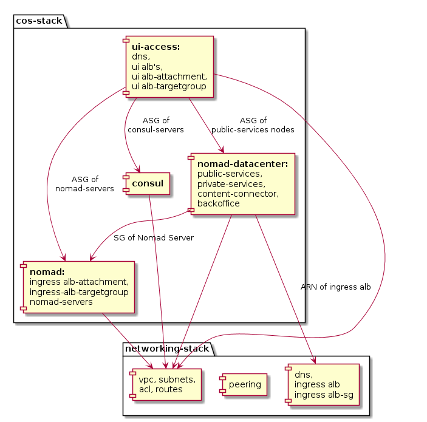

# Basic Container Orchestration System

Making use of Terraform and Nomad to setup a Container Orchestration System.
This respository will provide an extended example from the main [nomad terraform module](https://github.com/hashicorp/terraform-aws-nomad/tree/master/examples/nomad-consul-separate-cluster)

## Architecture


The COS (Container Orchestration System) consists of three core components.

1. A Container of [nomad servers](modules/nomad) servers (NMS, the leaders).
2. Several [nomad clients](modules/nomad-datacenter) (NMC).
3. A Container of [consul servers](modules/consul) used as service registry. Together with the `consul-agents` on each of the instances, Consul is used as Service Discovery System.

The Nomad instances are organized in so called data-centers. A data-center is a group of Nomad instances. A data-center can be specified as destination of a deployment of a Nomad job.*

The COS organizes it's nodes in five different data-centers.

1. **DC leader**: Contains the Nomad servers (NMS).
2. **DC backoffice**: Contains those Nomad Clients (NMC) that provide basice functionality in order to run services. For example the Prometheus servers and Grafana runs there.
3. **DC public-services**: Contains public facing services. These are services the clients directly get in touch with. They process ingress traffic. Thus an ingress load-balancer like Fabio runs on those nodes.
4. **DC private-services**: Contains services wich are used internally. Those services do the real work, but need no access from/to the internet.
5. **DC content-connector**: Contains services which are used to obtain/scrape data from external sources. They usually load data from content-providers.

The data-centers of the COS are organized/live in three different subnets.

1. **Backoffice**: This is the most important one, since it contains the most important instances, like the Nomad servers. Thus it's restricted the most and has no access to the internet (either ingress nor egress).
2. **Services**: This subnet contains the services that need no egress access to the internet. Ingress access is only granted for some of them over an ALB, but not directly.
3. **Content-Connector**: This subnet contains services that need egress access to the internet in order to obtain data from conent-providers.

### Docker Registry

This Container Orchestration System allows to pull docker images from public docker registries like Docker Hub and from AWS ECR.

Regarding AWS ECR, **it is only possible to pull from the registry of the AWS account and region where this COS is deployed to**. Thus you have to create an ECR in the same region on the same account and push your docker images there.

### HA-Setup


The `consul-servers` as well as the `nomad-servers` are build up in an high-availability set up. At least three Consul and Nomad servers are deployed in different availability-zones. The `nomad-clients` are deployed in three different AZ's as well.

## Structure

### _docs

Providing detailed documentation for this module.

### examples

Provides example instanziation of this module.
The [root-example](examples/root-example) builds up a full working `nomad-cluster` including the underlying networking, the Nomad servers and clients and a Consul Container for service discovery.

### modules

Terraform modules for separate aspects of the Container Orchestration System.

- [nomad](modules/nomad): Module that creates a Container of Nnomad masters.
- [nomad-datacenter](modules/nomad-datacenter): Module that creates a Container of Nomad clients for a specific data-center.
- [consul](modules/consul): Module building up a Consul Container.
- [ui-access](modules/ui-access): Module building up alb's to grant access to Nomad, Consul and Fabio UI.
- [sgrules](modules/sgrules): Module connecting security groups of instances apropriately to grant the minimal needed access.
- [ami](modules/ami): Module for creating an AMI having Nomad, Consul and docker installed (based on Amazon Linux AMI 2018.03.0 (HVM)).
- [ami2](modules/ami2): Module for creating an AMI having Nomad, Consul and docker installed (based on Amazon Linux AMI 2018.03.0 (HVM)).
- [networking](modules/networking): **This module is only used to support the examples**. It is not part of the main Container Orchestration System module.

#### Module Dependencies

The picture shows the dependencies within the modules of the `cos-stack` and the dependencies to the `networking-stack`.


## Troubleshooting

### Nomad CLI complains about invalid Certificate

If you have deployed the Container with https endpoints for the ui-albs and have created a selfsigned certificate you might get errors from the Nomad cli complanig about an invalid certificate (`x509: certificate is..`). To fix this you have to integrate your custom root-CA you used for signing your certificate apropriately into your system.

#### Provide access to CA cert-file

Therefore you have to store the PEM encoded CA cert-file locally and give the information where to find it to Nomad.

There are two options:
1. `-ca-cert=<path>` flag or `NOMAD_CACERT` environment variable
2. `-ca-path=<path>` flag or `NOMAD_CAPATH` environment variable

#### Disable Certificate verification

To overcome certificate verification issues you can also (not recommended) temporarily skip the certificate verification when using the Nomad CLI.
1. `-tls-skip-verify`
As additional parameter in your cli calls.
i.e. `nomad plan -tls-skip-verify jobfile.nomad`
2. `NOMAD_SKIP_VERIFY`
Just set the environment variable to 1.
`export Nomad_SKIP_VERIFY=1`
And then call your CLI commands as usual.
i.e. `nomad plan jobfile.nomad`

## Documentation generation
Documentation should be modified within `main.tf` and generated using [terraform-docs](https://github.com/segmentio/terraform-docs):
```bash
terraform-docs md ./ |sed '$d' >| README.md
```
## License
GPL 3.0 Licensed. See [LICENSE](https://github.com/ehime/terraform-cos/tree/master/LICENSE) for full details.

## References

- [Nomad Terraform Module](https://github.com/hashicorp/terraform-aws-nomad)
- [Consul Terraform Module](https://github.com/hashicorp/terraform-aws-consul)


## Inputs

| Name | Description | Type | Default | Required |
|------|-------------|:----:|:-----:|:-----:|
| additional_instance_tags_backoffice_dc | List of tags to add to the backoffice datacenter instances. The entries of the list are maps consiting of key, value and propagate at launch. | list | `<list>` | no |
| additional_instance_tags_content_connector_dc | List of tags to add to the content_connector datacenter instances. The entries of the list are maps consiting of key, value and propagate at launch. | list | `<list>` | no |
| additional_instance_tags_private_services_dc | List of tags to add to the private_services datacenter instances. The entries of the list are maps consiting of key, value and propagate at launch. | list | `<list>` | no |
| additional_instance_tags_public_services_dc | List of tags to add to the public_services datacenter instances. The entries of the list are maps consiting of key, value and propagate at launch. | list | `<list>` | no |
| alb_backoffice_https_listener_arn | The arn of the https alb listener for the backoffice data-center. To attach the alb listener to the backoffice data-center the variable attach_backoffice_alb_listener has to be set to true as well. | string | `` | no |
| alb_ingress_https_listener_arn | The arn of the https alb listener for ingress data. | string | - | yes |
| alb_subnet_ids | Ids of the subnets to deploy the alb's into. | list | - | yes |
| allowed_cidr_blocks_for_ui_alb | Map for cidr blocks that should get access over alb. The format is name:cidr-block. I.e. 'my_cidr'='90.250.75.79/32' | map | `<map>` | no |
| allowed_ssh_cidr_blocks | A list of cidr block from which inbound ssh traffic should be allowed. | list | `<list>` | no |
| attach_backoffice_alb_listener | Set this to true in case an alb shall be attached to the backoffice data-center. In this case the variable alb_backoffice_https_listener_arn has to be set specifying the correct alb listener. | string | `false` | no |
| aws_region | region this stack should be applied to | string | - | yes |
| consul_ami_id | The ID of the AMI to be used for the consul nodes. | string | - | yes |
| consul_instance_type | The instance type for all consul server nodes. | string | `t3.medium` | no |
| consul_num_servers | The number of Consul server nodes to deploy. We strongly recommend using 3 or 5. | string | `3` | no |
| consul_server_subnet_ids | Ids of the subnets to deploy the consul servers into. | list | - | yes |
| device_to_mount_target_map_backoffice_dc | List of device to mount target entries. | list | `<list>` | no |
| device_to_mount_target_map_content_connector_dc | List of device to mount target entries. | list | `<list>` | no |
| device_to_mount_target_map_private_services_dc | List of device to mount target entries. | list | `<list>` | no |
| device_to_mount_target_map_public_services_dc | List of device to mount target entries. | list | `<list>` | no |
| ebs_block_devices_backoffice_dc | List of ebs volume definitions for those ebs_volumes that should be added to the instances of the backoffice dc. Each element in the list is a map containing keys defined for ebs_block_device (see: https://www.terraform.io/docs/providers/aws/r/launch_configuration.html#ebs_block_device. | list | `<list>` | no |
| ebs_block_devices_content_connector_dc | List of ebs volume definitions for those ebs_volumes that should be added to the instances of the content-connector dc. Each element in the list is a map containing keys defined for ebs_block_device (see: https://www.terraform.io/docs/providers/aws/r/launch_configuration.html#ebs_block_device. | list | `<list>` | no |
| ebs_block_devices_private_services_dc | List of ebs volume definitions for those ebs_volumes that should be added to the instances created with the EC2 launch-configurationd. Each element in the list is a map containing keys defined for ebs_block_device (see: https://www.terraform.io/docs/providers/aws/r/launch_configuration.html#ebs_block_device. | list | `<list>` | no |
| ebs_block_devices_public_services_dc | List of ebs volume definitions for those ebs_volumes that should be added to the instances of the public-services dc. Each element in the list is a map containing keys defined for ebs_block_device (see: https://www.terraform.io/docs/providers/aws/r/launch_configuration.html#ebs_block_device. | list | `<list>` | no |
| ecr_repositories | List of names for the ECR repositories to be created. Nomad will use them to get docker images from it in the job files. | list | `<list>` | no |
| efs_dns_name | DNS name of the efs this nodes should have access to. | string | `` | no |
| env_name | Name of the environment (i.e. prod). | string | `playground` | no |
| instance_type_server | The instance type for all nomad and consul server nodes. | string | `t3.medium` | no |
| map_bucket_name | name of the s3 bucket carrying the maps. | string | `` | no |
| nomad_ami_id_clients | The ID of the AMI to be used for the nomad clientnodes. | string | - | yes |
| nomad_ami_id_servers | The ID of the AMI to be used for the nomad server nodes. | string | - | yes |
| nomad_backoffice_dc_node_cfg | Node configuration for the nomad nodes of the backoffice data center. | map | `<map>` | no |
| nomad_clients_backoffice_subnet_ids | Ids of the subnets to deploy the nomad client nodes providing the data-center backoffice into. | list | - | yes |
| nomad_clients_content_connector_subnet_ids | Ids of the subnets to deploy the nomad client nodes providing the data-center content-connector into. | list | - | yes |
| nomad_clients_private_services_subnet_ids | Ids of the subnets to deploy the nomad client nodes providing the data-center private-services into. | list | - | yes |
| nomad_clients_public_services_subnet_ids | Ids of the subnets to deploy the nomad client nodes providing the data-center public-services into. | list | - | yes |
| nomad_content_connector_dc_node_cfg | Node configuration for the nomad nodes of the content-connetor data center. | map | `<map>` | no |
| nomad_private_services_dc_node_cfg | Node configuration for the nomad nodes of the private-services data center. | map | `<map>` | no |
| nomad_public_services_dc_node_cfg | Node configuration for the nomad nodes of the public-services data center. | map | `<map>` | no |
| nomad_server_scaling_cfg | Scaling configuration for the nomad servers. | map | `<map>` | no |
| nomad_server_subnet_ids | Ids of the subnets to deploy the nomad servers into. | list | - | yes |
| ssh_key_name | The name of an EC2 Key Pair that can be used to SSH to the EC2 Instances in this cluster. Set to an empty string to not associate a Key Pair. | string | `` | no |
| stack_name | Shortcut for this stack. | string | `COS` | no |
| ui_alb_https_listener_cert_arn | ARN of the certificate that should be used to set up the https endpoint for the ui-alb's. If not provided, a http enpoint will be created. | string | `` | no |
| ui_alb_use_https_listener | If true, the https endpoint for the ui-albs will be created instead of the http one. Precondition for this is that ui_alb_https_listener_cert_arn is set apropriately. | string | `false` | no |
| unique_postfix | A postfix to be used to generate unique resource names per deployment. | string | `` | no |
| vpc_id | Id of the vpc where to place in the instances. | string | - | yes |

## Outputs

| Name | Description |
|------|-------------|
| aws_region | The AWS region to deploy into |
| cluster_prefix | Clustering prefix |
| consul_servers_cluster_tag_key | Consul servers tag identifier |
| consul_servers_cluster_tag_value | Consul servers tag identification value |
| consul_servers_sg_id | Consuls security group id |
| consul_ui_alb_dns_name | Consul UI cluster address |
| consul_ui_alb_zone_id | Consuls zone identifier |
| dc-backoffice_sg_id | Backoffice security group id |
| dc-private-services_sg_id | Private services security group id |
| dc-public-services_sg_id | Public services security group id |
| fabio_ui_alb_dns_name | Fabio UI address |
| fabio_ui_alb_zone_id | Fabios zone identifier |
| nomad_clients_public_services_cluster_tag_value | Nomad clients identification tag value |
| nomad_servers_cluster_tag_key | Nomad servers identifier tag |
| nomad_servers_cluster_tag_value | Nomad servers identifcation tag value |
| nomad_ui_alb_dns_name | Nomad UI cluster address |
| nomad_ui_alb_zone_id | Nomads zone identifier |
| num_nomad_servers | Amount of Nomad servers to deploy |
| ssh_key_name | SSH key in implementation |
| vpc_id | VPC identifier |
